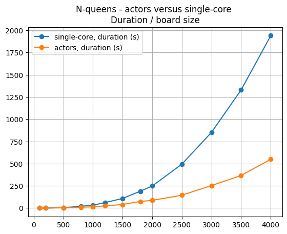

# N-queens

## Search one solution to the N-queens problem. Benchmark.

2 families of algorithms:

-   Depth-first search, with backtracking: slow, lot of recursion,
-   heuristic with progressive improvements and randomness: fast, not 100% safe.

## Comments on results

**DFS**

-   The basic DFS stores the position of the board in a list of lists of boxes.
    The tests are done by reading the contents of the board. It's not effective.
-   Advanced DFS only stores queens coordinates (in a one-dimensional single list).
    The tests are performed by calculating integer divisions and modulos.

But Python is slow on calculations and fast on accessing lists. So the results:

-   Basic DFS, Python: 0.851s
-   Advanced DFS, Python: 2.705s, slower then basic!

Then using Cython+, the calculations are done in C++:

-   Basic DFS, Cython+ single-core: 0.299s (speed/python almost x3)
-   Advanced DFS, Cython+ single-core: 0.086s, faster than basic, (speed/python almost x10)

However, DFS is not possible for large map sizes: by changing the map size from
18 to 28, the result goes from 0.086s to 14.133s. And this algorithm is not suitable
for parallelization.

**Heuristic**

On a large board, using custom heuristics (gradually improving queens placement with
some randomness), board size of 250x250:

-   Python: 53.085s
-   Cython+ single-core: 2.002s
-   Cython+ with parallel actors: 2.153s

The implementation with actors is slower, the additional cost of actors is not
compensated by the parallelization gains.

When using a board size of 1000x1000, actors become faster than single-core computation:
-   Cython+ single-core: 35.667s
-   Cython+ with parallel actors: 15.399s

For bigger boards:

## Expected results:

To proceed:

      ./make_all.sh
      ./launch_all.sh

Resulst:

    ./launch_all.sh
    ============================================================================
    N-queens, basic DFS, pure python
    params: [18]
    solving for size 18:
    * . . . . . . . . . . . . . . . . .
    . . . * . . . . . . . . . . . . . .
    . * . . . . . . . . . . . . . . . .
    . . . . . . . . . . . . . * . . . .
    . . * . . . . . . . . . . . . . . .
    . . . . . . . . . . * . . . . . . .
    . . . . . . . . . . . . * . . . . .
    . . . . * . . . . . . . . . . . . .
    . . . . . . . . . . . . . . . * . .
    . . . . . . . . . . . . . . . . . *
    . . . . . . . . . . . . . . * . . .
    . . . . . . * . . . . . . . . . . .
    . . . . . . . . * . . . . . . . . .
    . . . . . . . . . . . . . . . . * .
    . . . . . * . . . . . . . . . . . .
    . . . . . . . * . . . . . . . . . .
    . . . . . . . . . * . . . . . . . .
    . . . . . . . . . . . * . . . . . .
    duration: 0.851s

    ============================================================================
    N-queens, basic DFS, cython+ single-core
    params: [18]
    solving for size 18:
    * . . . . . . . . . . . . . . . . .
    . . . * . . . . . . . . . . . . . .
    . * . . . . . . . . . . . . . . . .
    . . . . . . . . . . . . . * . . . .
    . . * . . . . . . . . . . . . . . .
    . . . . . . . . . . * . . . . . . .
    . . . . . . . . . . . . * . . . . .
    . . . . * . . . . . . . . . . . . .
    . . . . . . . . . . . . . . . * . .
    . . . . . . . . . . . . . . . . . *
    . . . . . . . . . . . . . . * . . .
    . . . . . . * . . . . . . . . . . .
    . . . . . . . . * . . . . . . . . .
    . . . . . . . . . . . . . . . . * .
    . . . . . * . . . . . . . . . . . .
    . . . . . . . * . . . . . . . . . .
    . . . . . . . . . * . . . . . . . .
    . . . . . . . . . . . * . . . . . .
    duration: 0.299s

    ============================================================================
    N-queens, advanced DFS, pure python
    params: [18]
    solving for size 18:
    * . . . . . . . . . . . . . . . . .
    . . * . . . . . . . . . . . . . . .
    . . . . * . . . . . . . . . . . . .
    . * . . . . . . . . . . . . . . . .
    . . . . . . . * . . . . . . . . . .
    . . . . . . . . . . . . . . * . . .
    . . . . . . . . . . . * . . . . . .
    . . . . . . . . . . . . . . . * . .
    . . . . . . . . . . . . * . . . . .
    . . . . . . . . . . . . . . . . * .
    . . . . . * . . . . . . . . . . . .
    . . . . . . . . . . . . . . . . . *
    . . . . . . * . . . . . . . . . . .
    . . . * . . . . . . . . . . . . . .
    . . . . . . . . . . * . . . . . . .
    . . . . . . . . * . . . . . . . . .
    . . . . . . . . . . . . . * . . . .
    . . . . . . . . . * . . . . . . . .
    duration: 2.705s

    ============================================================================
    N-queens, advanced DFS, cython+ single-core
    params: [18]
    solving for size 18:
    * . . . . . . . . . . . . . . . . .
    . . * . . . . . . . . . . . . . . .
    . . . . * . . . . . . . . . . . . .
    . * . . . . . . . . . . . . . . . .
    . . . . . . . * . . . . . . . . . .
    . . . . . . . . . . . . . . * . . .
    . . . . . . . . . . . * . . . . . .
    . . . . . . . . . . . . . . . * . .
    . . . . . . . . . . . . * . . . . .
    . . . . . . . . . . . . . . . . * .
    . . . . . * . . . . . . . . . . . .
    . . . . . . . . . . . . . . . . . *
    . . . . . . * . . . . . . . . . . .
    . . . * . . . . . . . . . . . . . .
    . . . . . . . . . . * . . . . . . .
    . . . . . . . . * . . . . . . . . .
    . . . . . . . . . . . . . * . . . .
    . . . . . . . . . * . . . . . . . .
    duration: 0.086s

    Other test:
    N-queens, advanced DFS, cython+ single-core
    params: [28]
    solving for size 28:
    * . . . . . . . . . . . . . . . . . . . . . . . . . . .
    . . * . . . . . . . . . . . . . . . . . . . . . . . . .
    . . . . * . . . . . . . . . . . . . . . . . . . . . . .
    . * . . . . . . . . . . . . . . . . . . . . . . . . . .
    . . . * . . . . . . . . . . . . . . . . . . . . . . . .
    . . . . . . . . * . . . . . . . . . . . . . . . . . . .
    . . . . . . . . . . * . . . . . . . . . . . . . . . . .
    . . . . . . . . . . . . * . . . . . . . . . . . . . . .
    . . . . . . . . . . . . . . * . . . . . . . . . . . . .
    . . . . . . . . . . . . . . . . * . . . . . . . . . . .
    . . . . . . . . . . . . . . . . . . . . . . * . . . . .
    . . . . . . . . . . . . . . . . . . . . . . . . * . . .
    . . . . . . . . . . . . . . . . . . . . . * . . . . . .
    . . . . . . . . . . . . . . . . . . . . . . . . . . . *
    . . . . . . . . . . . . . . . . . . . . . . . . . * . .
    . . . . . . . . . . . . . . . . . . . . . . . * . . . .
    . . . . . . . . . . . . . . . . . . . . . . . . . . * .
    . . . . . . * . . . . . . . . . . . . . . . . . . . . .
    . . . . . . . . . . . * . . . . . . . . . . . . . . . .
    . . . . . . . . . . . . . . . * . . . . . . . . . . . .
    . . . . . . . . . . . . . . . . . * . . . . . . . . . .
    . . . . . . . * . . . . . . . . . . . . . . . . . . . .
    . . . . . . . . . * . . . . . . . . . . . . . . . . . .
    . . . . . . . . . . . . . * . . . . . . . . . . . . . .
    . . . . . . . . . . . . . . . . . . . * . . . . . . . .
    . . . . . * . . . . . . . . . . . . . . . . . . . . . .
    . . . . . . . . . . . . . . . . . . . . * . . . . . . .
    . . . . . . . . . . . . . . . . . . * . . . . . . . . .
    duration: 14.133s

    ============================================================================
    N-queens, heuristic, sum of 5 runs, pure python
    params: [250, 5]
    solving for size 250
    duration for size 250: 9.436s
    solving for size 250
    duration for size 250: 8.718s
    solving for size 250
    duration for size 250: 10.538s
    solving for size 250
    duration for size 250: 9.129s
    solving for size 250
    duration for size 250: 15.264s
    duration: 53.085s

    ============================================================================
    N-queens, heuristic, sum of 5 runs, cython+ single-core
    params: [250, 5]
    solving for size 250
    duration for size 250: ~0s
    solving for size 250
    duration for size 250: ~0s
    solving for size 250
    duration for size 250: ~1s
    solving for size 250
    duration for size 250: ~0s
    solving for size 250
    duration for size 250: ~1s
    duration: 2.002s

    Other test:
    N-queens, heuristic, sum of 2 runs, cython+ single-core
    params: [1000, 2]
    solving for size 1000
    duration for size 1000: ~18s
    solving for size 1000
    duration for size 1000: ~17s
    duration: 35.667s

    ============================================================================
    N-queens, heuristic, sum of 5 runs, cython+ actors
    params: [250, 5]
    solving for size 250
    duration for size 250: ~1s
    solving for size 250
    duration for size 250: ~0s
    solving for size 250
    duration for size 250: ~1s
    solving for size 250
    duration for size 250: ~0s
    solving for size 250
    duration for size 250: ~0s
    duration: 2.153s

    Other test:
    N-queens, heuristic, sum of 2 runs, cython+ actors
    params: [1000, 2]
    solving for size 1000
    duration for size 1000: ~8s
    solving for size 1000
    duration for size 1000: ~8s
    duration: 15.399s
